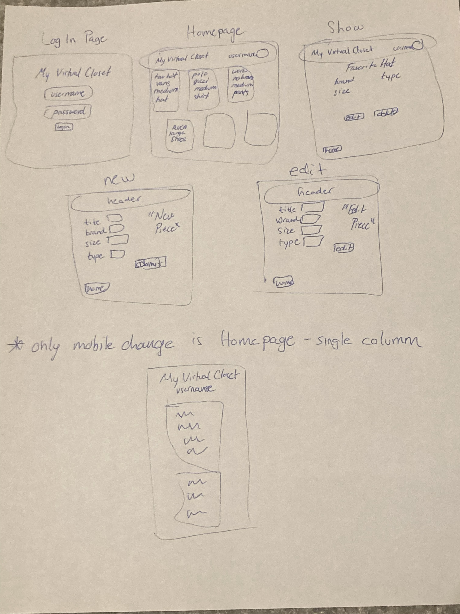

# Seal Project 2

- **Alex Greenberg**
- **My Virtual Closet**
- **My App allows a user to log in and access their current closet of clothes, hats, shoes, etc. They are able to access all of the apparel in their closet based on title, type of apparel, size and brand. As they purchase more clothes, they can simply create new items, delete those they donate and edit those they send for repair or size adjustments!**
- **https://github.com/a1g23/seal_project2**
- **https://seal-project2.onrender.com/**
- **https://trello.com/b/Eup4TM5d/seal-project-2**

## List of Dependencies

##### Node Dependencies

- express
- ejs
- method override
- mongoose
- morgan
- bcrypt

## Route Map

| Route Name | Endpoint | Method | Description |
|------------|----------|--------|-------------|
| Apparel Index | /apparel    | GET    | Renders all of the apparel on a page |
| New Apparel Form | /apparel/new   | GET    | Renders a form to add a new piece of apparel |
| Create Apparel | /apparel    | POST    | Creates the new apparel from the form |
| Edit Apparel Form | /apparel/:id/edit    | GET    | Renders a form to edit an existing piece of apparel |
| Update Apparel | /apparel/:id   | PUT    | Updates the existing apparel from the form  |
| Remove Apparel | /apparel/:id   | DELETE    | Deletes the apparel selected |
| Show Apparel | /apparel/:id    | GET    | Renders a detailed page of the apparel |

## Design Mockups (Desktop + Mobile)

##### Design

## ERD (Entity Relationship Diagram)

This should be a diagram showing your models and any relationships between them.

